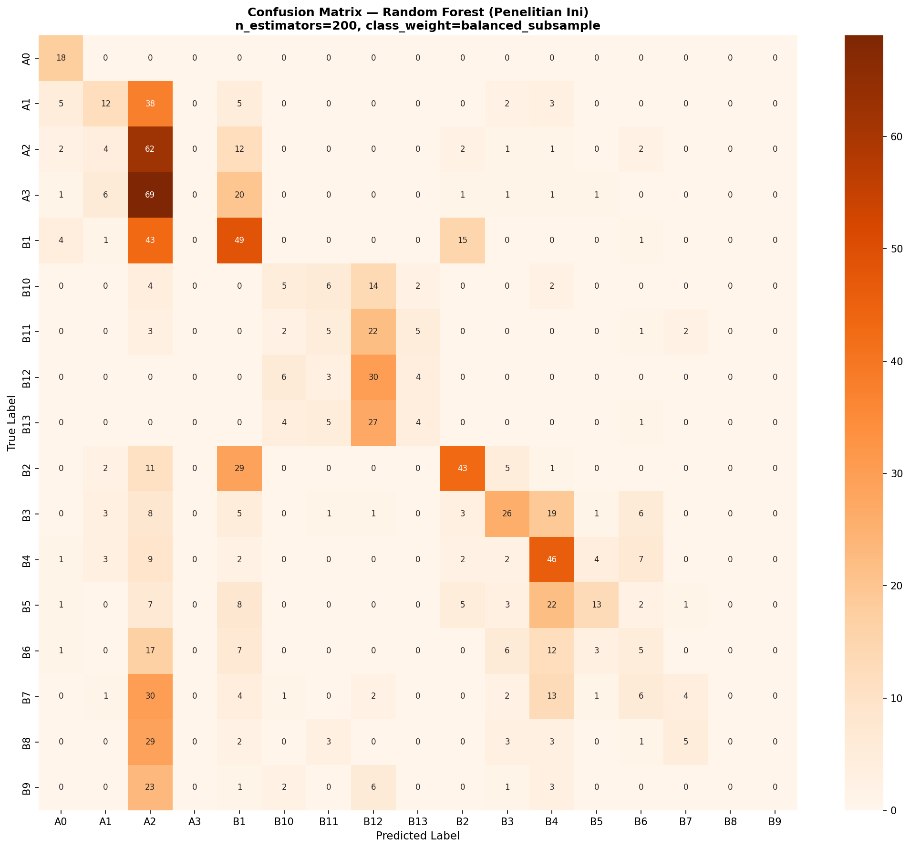
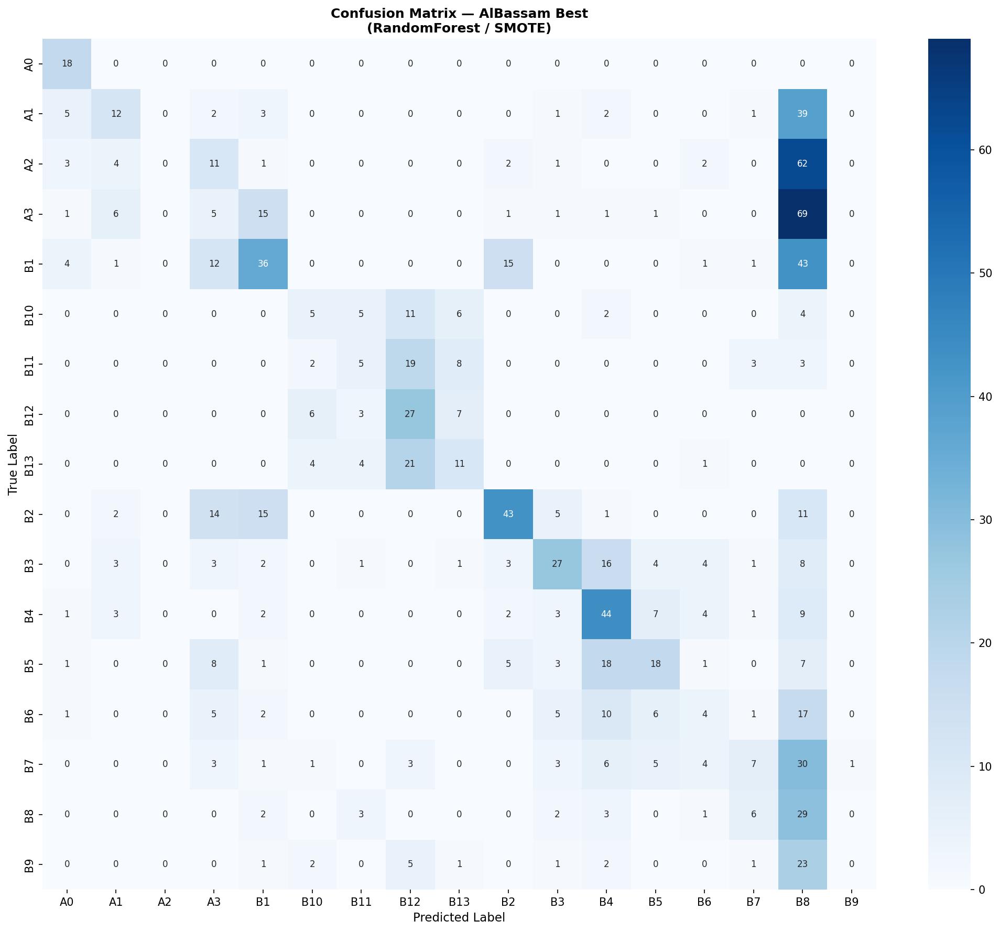
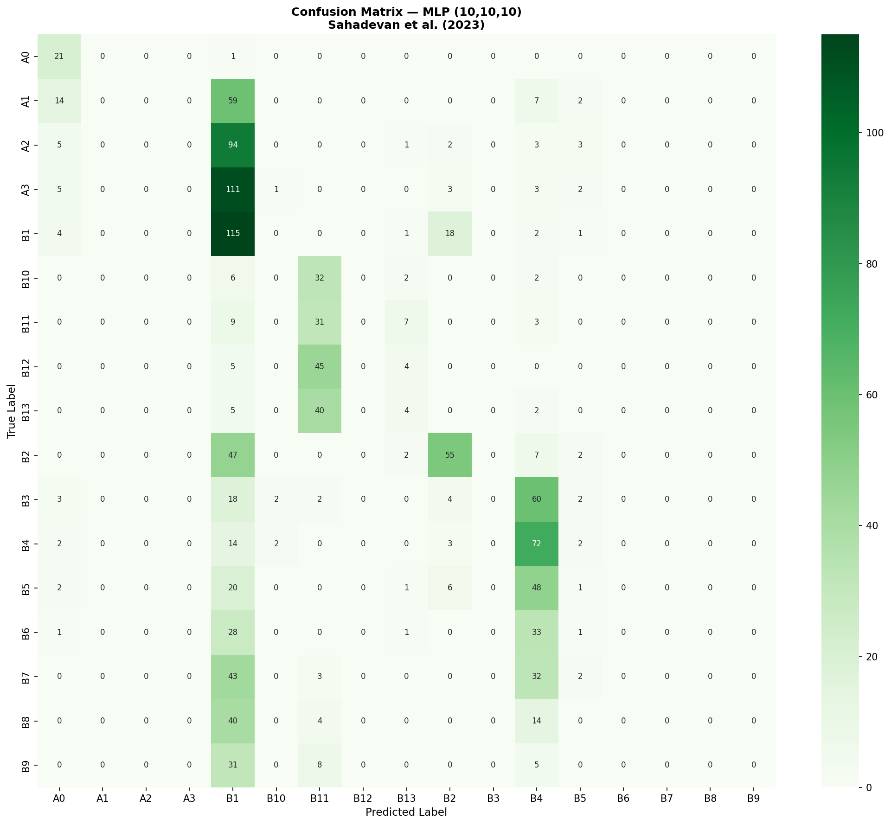
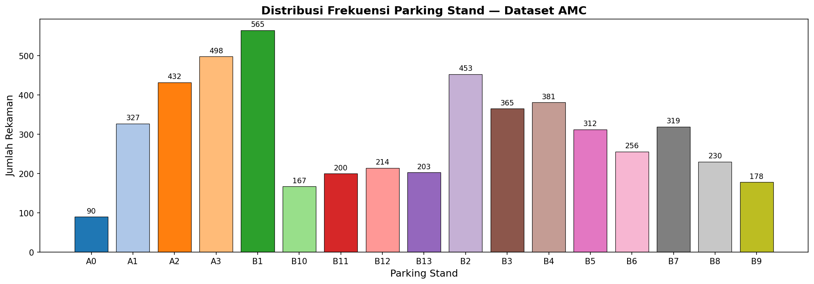

# Perbandingan Akhir — Semua Metode

**Eksperimen:** AlBassam & AlShahrani (2025) vs Sahadevan et al. (2023) vs RF Penelitian Ini
**Dataset:** DATASET_AMC_fields_used.csv (5190 rekaman, 17 kelas parking stand)
**Metrik:** Top-1/3/5 Accuracy, Macro Precision/Recall/F1, Weighted F1, MCC, ROC-AUC

---

## Tabel Perbandingan

| Method | Sumber Paper | Resampler | Top-1 Acc | Top-3 Acc | Top-5 Acc | Macro Prec | Macro Rec | Macro F1 | Weighted F1 | MCC | ROC-AUC |
|--------|-------------|-----------|-----------|-----------|-----------|------------|-----------|----------|-------------|-----|---------|
| **Random Forest (Penelitian Ini)** * | Penelitian Ini | SMOTE | 31.02% | 58.96% | 79.00% | 29.35% | 30.68% | 26.21% | 26.74% | 0.2691 | 0.8200 |
| **RandomForest (AlBassam)** | AlBassam & AlShahrani (2025) | SMOTE | 28.03% | 58.57% | 78.61% | 30.18% | 30.92% | 27.38% | 27.05% | 0.2490 | 0.8186 |
| **MLP (10,10,10) (Sahadevan)** | Sahadevan et al. (2023) | SMOTE | 23.04% | 57.16% | 72.65% | 10.67% | 21.92% | 12.66% | 13.15% | 0.1842 | 0.7534 |

\* = metode terbaik berdasarkan Top-1 Accuracy

---

## Kesimpulan

### Metode Terbaik pada Dataset Parking Stand AMC

Berdasarkan hasil evaluasi pada dataset historis AMC Bandar Udara Halim Perdanakusuma (5190 rekaman, 17 kelas parking stand), metode dengan performa terbaik adalah **Random Forest (Penelitian Ini)** dengan Top-1 Accuracy 31.02%, Top-3 Accuracy 58.96%, Top-5 Accuracy 79.00%, Macro F1 26.21%, MCC 0.2691, dan ROC-AUC 0.8200.

### Perbandingan RF Penelitian Ini dengan Metode Pembanding

Random Forest (Penelitian Ini) **mengungguli** kedua metode pembanding dengan Top-1 Accuracy 31.02%, di atas RandomForest AlBassam (28.03%) dan MLP Sahadevan (23.04%).

### Justifikasi Penggunaan Random Forest dalam Sistem AMC

Terlepas dari perbandingan angka numerik, *Random Forest* tetap menjadi pilihan yang tepat untuk sistem rekomendasi parking stand AMC karena dua alasan utama: **pertama**, Random Forest menghasilkan output `predict_proba()` yang menghasilkan distribusi probabilitas untuk seluruh kelas, sehingga sistem dapat menyajikan *Top-K* rekomendasi berperingkat kepada pengguna dalam antarmuka web DSS secara langsung, fitur yang tidak dimiliki secara alami oleh model seperti SVM atau MLP sederhana. **Kedua**, model Random Forest bersifat *lightweight* dan dapat dimuat dalam hitungan milidetik melalui file `.pkl` yang diintegrasikan ke dalam infrastruktur PHP-Python yang sudah berjalan di server XAMPP, tanpa memerlukan framework deep learning yang berat atau koneksi ke layanan eksternal, menjadikannya solusi yang lebih praktis dan dapat diinterpretasikan untuk kebutuhan operasional bandar udara skala kecil.

---

## Detail Konfigurasi Setiap Metode

### Random Forest (Penelitian Ini)
- **Hyperparameter:** `n_estimators=200, max_depth=None, min_samples_leaf=5, min_samples_split=2, class_weight=balanced_subsample`
- **Split:** 80/20, random_state=42
- **Resampler:** SMOTE

### RandomForest (AlBassam & AlShahrani, 2025)
- **Best Params:** `{'max_depth': 20, 'min_samples_split': 2, 'n_estimators': 100}`
- **Split:** 80/20, random_state=42
- **Resampler:** SMOTE

### MLP (10,10,10) (Sahadevan et al., 2023)
- **Arsitektur:** `hidden_layer_sizes=(10,10,10)`, `activation=relu`, `solver=adam`
- **Training:** `max_iter=500`, `early_stopping=True`, `validation_fraction=0.1`
- **Split:** 75/25, random_state=42
- **Resampler:** SMOTE

---

## Confusion Matrices

### Random Forest (Penelitian Ini)

### AlBassam Best Classifier

### MLP (Sahadevan)

### Distribusi Kelas Dataset

